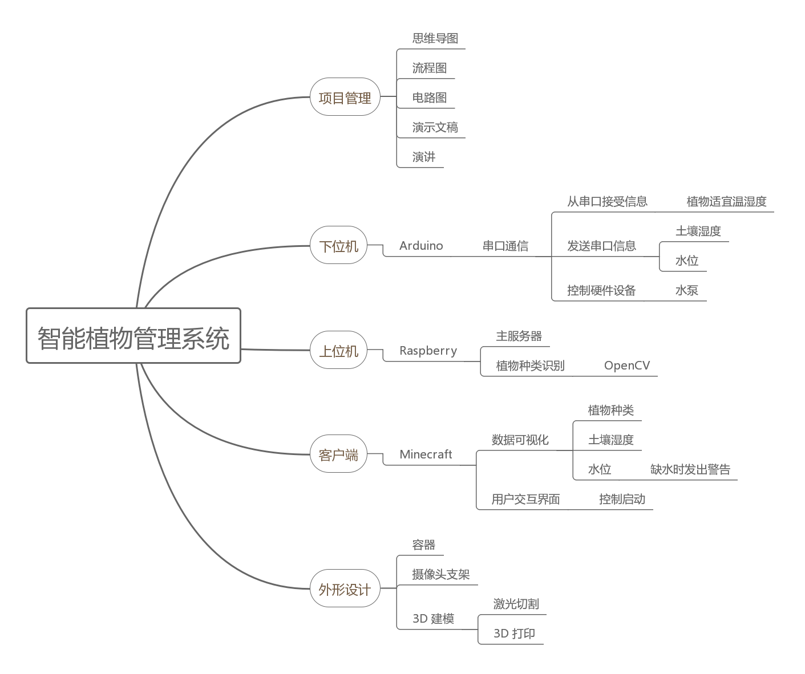
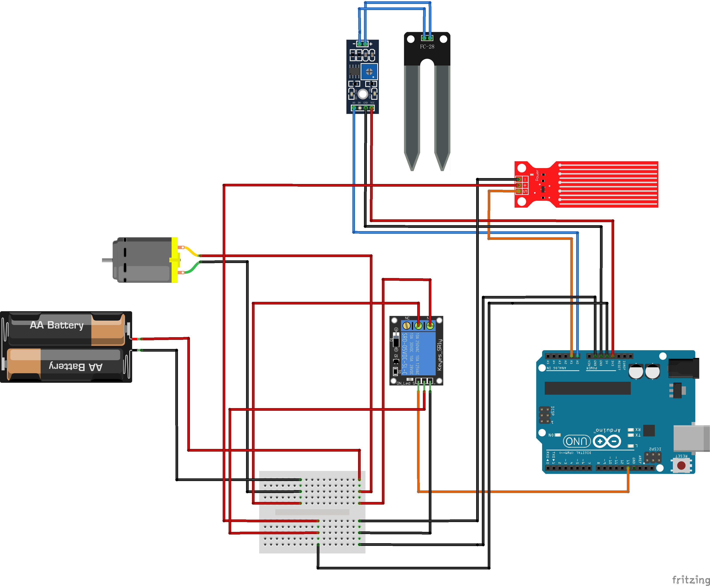
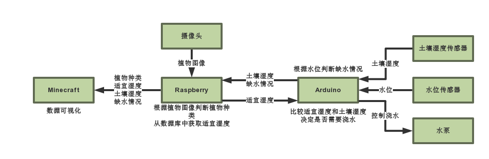
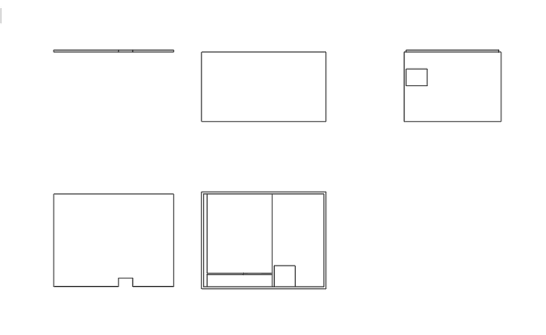
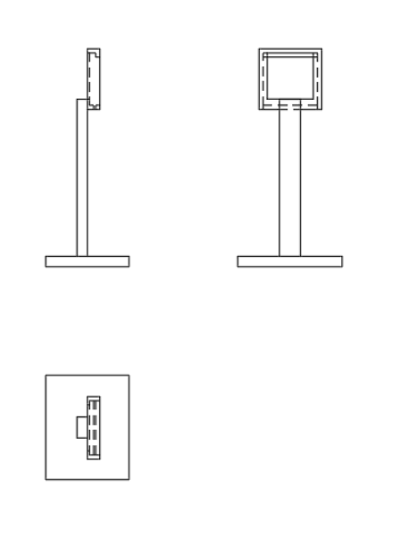

#  智能植物管理系统 

## 成员分工

- 黄程宇——项目管理 演示文稿
- 张启星——外形设计 3D 建模
- 吴隅——硬件设备 Arduino
- 陆弈人—— 计算机视觉 OpenCV
- 朱越——数据通信 服务器
- 刁隽宇——前端 Minecraft

## 什么是智能植物管理系统？

### 思维导图

## 为什么做这个项目？

1. 活用我们所学的知识
   1. 在这短短的几周时间里，我们从零开始学习了数字化制造及快速成型技术，让我们在短时间内可以实现项目设计和原型制作
   2. 而这一项目能够让我们每个人发挥自己的长处
2. 绿色植物对于快节奏的现代生活的重要性
   1. 随着人们生活水平的提高，越来越多的人开始追求绿色生活
   2. 养植物不仅可以装点室内空间，而且还可以增加我们呼吸的氧气含量，起到防辐射的作用等

## 它是如何工作的？

### 使用工具和技术

1. Arduino
2. Raspberry
3. OpenCV
4. 3D 打印
5. Python
6. Minecraft
7. DHCP 协议
8. SMB 协议
9. Hostapd
10. …

### 电路图

### 工作流程

### 3D 模型

#### 容器

#### 摄像头支架

### 使用说明

在Minecraft中显示一盆植物的湿度状况，分为0~10个级别，通过水方块来展示

有一个开关来控制自动浇水模式是否开启

开启时灯亮

当缺水时，红灯闪烁警示

## 与市面上的产品有何不同？

1. 更智能——利用OpenCV识别植物种类，智能调控植物适宜的环境
2. 更随心——不受限于时间和空间，可随时随地远程操控
3. 更新奇——全新的交互界面，基于Minecraft的游戏性体验

## 目标群体

1. 家用——时间不充裕的植物花卉爱好者
2. 农用——需要管理大量植物的相关专业人士

## 实施成本和可行性

1. 200 + 40 + 50 + … < 400
   - 一个Raspberry，一个Arduino，一个摄像头，再加几个简单的配件，就可以实现所有的功能
2. 集成化后可以进一步缩小成本
   - 商品化后，电路系统可以高度集成，缩小体积的同时，提升性价比

## 产品展示

### 客户端

可添加多个花盆多种植物

世界时间随真实时间变化

## 未来展望

1. 全面无线化
   1. 所有下位机通过WIFI无线连接Raspberry主服务器
2. 从多方面调控环境
   1. 增加温度、光照等传感器以及加热棒、遮光帘等，从而实现对阳光温度等环境的调控
3. 规模化
   1. 利用目标检测（Object Detection）技术，同时识别多盆植物
